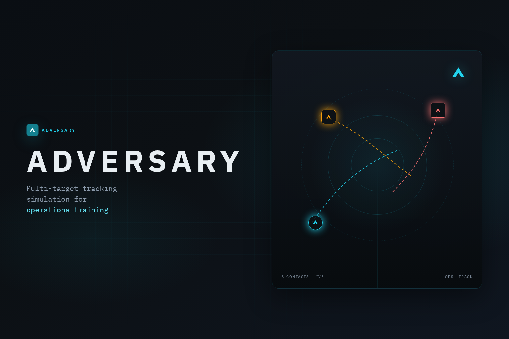
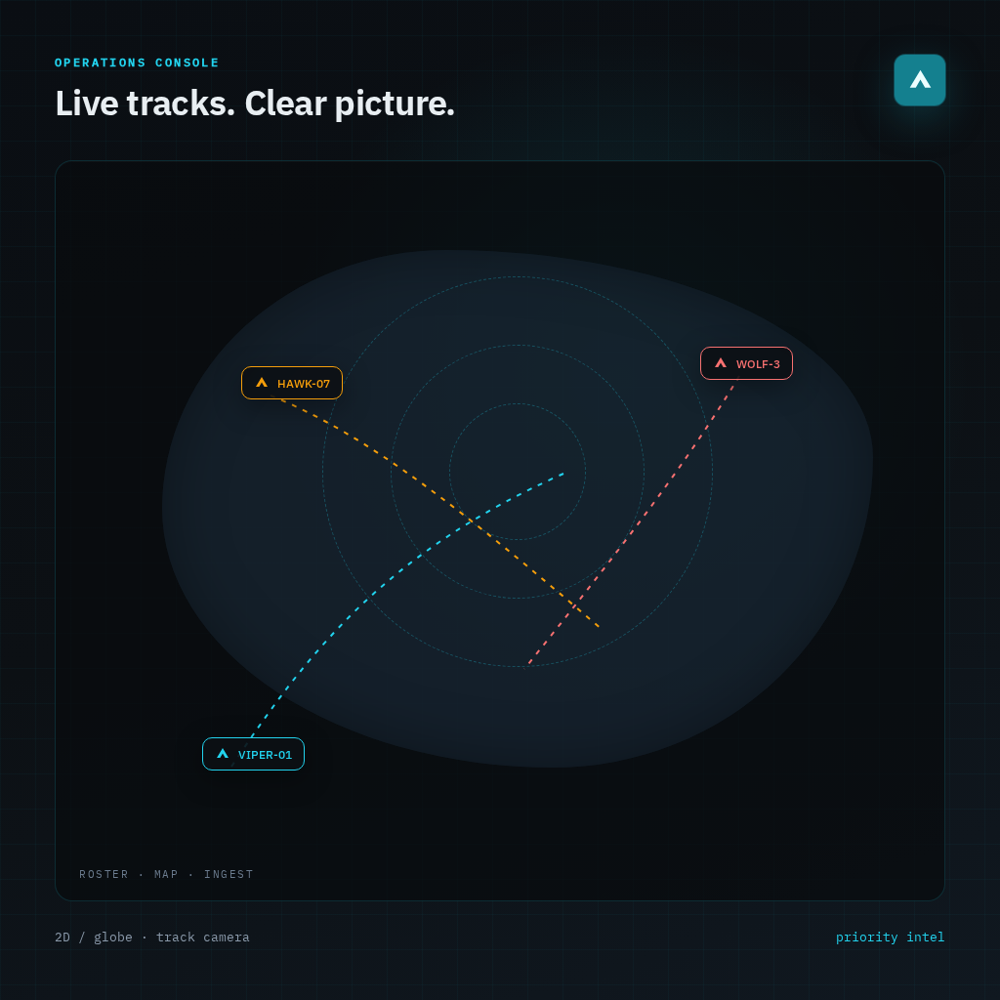
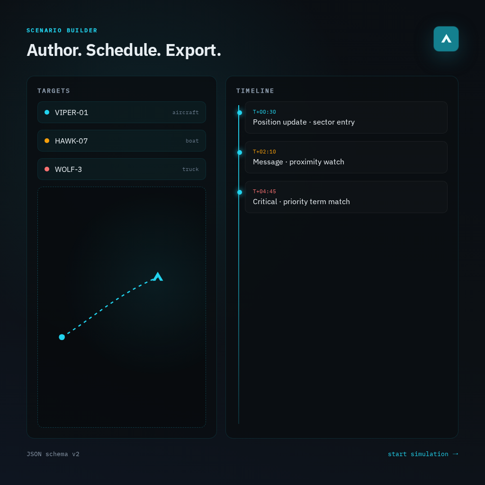
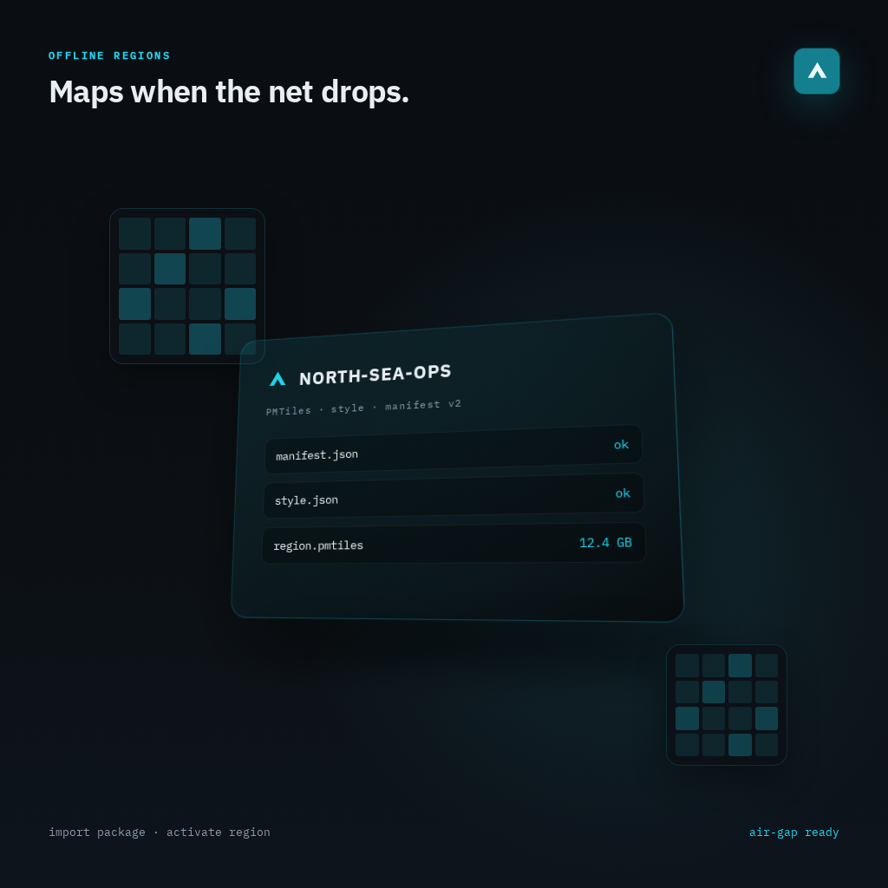

# Adversary

<p align="center">
  
</p>

**Adversary** is a browser-based multi-target tracking simulator. Author scenarios, replay timed position and message events, and run an operations console with live roster, map tracks, and priority intelligence — including a local-first OpenMapTiles stack for disconnected LAN deployments.

<p align="center">
  <a href="#quick-start"><strong>Quick start</strong></a> ·
  <a href="#how-to-use"><strong>How to use</strong></a> ·
  <a href="#scenario-format"><strong>Scenario format</strong></a> ·
  <a href="#deployment"><strong>Deployment</strong></a> ·
  <a href="#guides"><strong>Guides</strong></a>
</p>

---

## Why Adversary

Train operators, demo tracking workflows, or prototype geospatial intelligence pipelines without a live data feed. Scenarios are plain JSON: define targets, schedule events, hit **Start simulation**, and watch contacts appear on the map as time advances.

| Operations console | Scenario builder | Local-first maps |
| :---: | :---: | :---: |
|  |  |  |
| Live roster, track camera, event ingest, and priority alerts | Targets, routes, messages, demos, and schema-validated export | Traefik + tileserver-gl on `*.adversary` |

### Capabilities

- **Operations dashboard** — target roster, 2D / globe map, track / overview / pan camera, event ingest table, and priority message highlighting
- **Scenario builder** — author targets and timed events, generate routes, load random demos, preview, and start a run
- **Authentic random demos** — cars/trucks follow roads, boats stay in water, aircraft use runway-aligned flight patterns from local vector tiles (with per-track synthetic fallback)
- **JSON import** — upload or paste scenarios with inline schema docs and validation
- **Local-first maps** — planet OpenMapTiles via Docker tileserver-gl (Liberty / Dark), fronted by Traefik
- **Client-first** — scenarios and runtime state persist in IndexedDB; installable as a PWA

---

## Quick start

**Requirements:** [Node.js](https://nodejs.org/) 20+, [pnpm](https://pnpm.io/) 10+, Docker, and Go 1.26+

```bash
pnpm install
cp .env.example .env   # if you do not already have a root `.env`
pnpm dev:stack
```

This starts Postgres and Redis, migrates and serves the API on `:8080`, then starts Vite at [http://localhost:3001](http://localhost:3001). Leave `VITE_API_BASE_URL` empty to use Vite's `/v1` proxy. The app redirects to **Operations**. Map styles come from `VITE_MAP_STYLE_*` in the root `.env` (public basemaps by default in development).

To run only the web app:

```bash
pnpm run dev:web
```

After the API cache cutover, hard-refresh once if a browser still has an older service worker.

---

## How to use

### 1. Start a simulation

From an empty Operations screen:

1. Open **Settings** (gear) → **Builder**, or go to `/builder`
2. Click **Load random demo** (or pick a vehicle type), *or* author targets and events yourself
3. Click **Start simulation**
4. Return to **Operations** (`/operations`) to watch the run

**Load random demo** opens a dialog where you can multi-select regions (each shows supported vehicle categories), set an optional origin pin, choose vehicle types and target count, then generate. Placement precedence is **pin > selected regions > anywhere**. Generation streams targets into the builder with a progress readout and a **Cancel** button; if some tracks cannot be routed authentically they fall back to the synthetic generator and the completion toast reports how many degraded (and any categories relocated for lack of a compatible region).

Alternatively: **Settings** → **Import** (`/import`), upload a scenario JSON file, then start it from the builder or import flow.

### 2. Run the operations console

While a simulation is active:

- **Target roster** — contacts derived from received events; check **Track** to follow them on the map
- **Operational map** — toggle **2D / Globe**; camera modes: track, overview, pan
- **Event ingest** — ordered stream of position and message events
- **Intelligence messages** — messages matched against scenario `priorityTerms`

**Keyboard shortcuts**

| Shortcut | Action |
| --- | --- |
| `Ctrl/Cmd + K` | Command palette |
| `Shift + M` | Toggle 2D / globe |
| `Shift + S` | Stop simulation |
| `Shift + R` | Reset and open builder |

### 3. Author or import scenarios

**Builder** (`/builder`)

- Add targets (callsign, color, vehicle category, affiliation, status)
- Schedule position and/or message events
- Generate routes between waypoints
- Save drafts locally, export JSON, or start immediately

**Import** (`/import`)

- Drag-and-drop or paste scenario JSON
- Browse schema documentation and cross-field rules
- Valid scenarios can be saved and started

### 4. Map styles & environment

Client configuration lives in the **repo root** `.env` and is validated by [`packages/env/src/web.ts`](packages/env/src/web.ts) (`@t3-oss/env-core` + Zod). Copy [`.env.example`](.env.example) to `.env` for local development. Vite loads env from the monorepo root (`envDir` in `apps/web/vite.config.ts`).

| Variable | Purpose |
| --- | --- |
| `VITE_MAP_STYLE_LIGHT` | MapLibre style URL for light theme |
| `VITE_MAP_STYLE_DARK` | MapLibre style URL for dark theme |
| `VITE_GEO_TILEJSON_URL` | OpenMapTiles TileJSON for authentic demo routing (roads / water / terrain) |

**Development (Vite):** public basemap and TileJSON URLs are fine (defaults in `.env.example`). Geo routing defaults to `https://tiles.openfreemap.org/planet`.

**Local-first Docker:** set (or uncomment) tileserver URLs in the root `.env` before building:

```bash
VITE_MAP_STYLE_LIGHT=http://tiles.adversary/styles/liberty/style.json
VITE_MAP_STYLE_DARK=http://tiles.adversary/styles/dark/style.json
VITE_GEO_TILEJSON_URL=http://tiles.adversary/data/openmaptiles.json
```

Compose also falls back to those tileserver URLs for build args if the variables are unset. `VITE_*` values are **baked in at build time**. Changing them for a Docker image requires `pnpm run docker:build` (or `docker:up --build`).

**Adding a future env var**

1. Add a Zod field under `client` in `packages/env/src/web.ts` (name must start with `VITE_`)
2. Set it in root `.env` / `.env.example`
3. Import `env` from `@adversary/env/web` and use `env.VITE_…`
4. Rebuild Docker images after changing production values

---

## Scenario format

Scenarios use **schema version 2**. Minimal shape:

```json
{
  "schemaVersion": 2,
  "id": "scenario-demo-1",
  "name": "Channel transit",
  "createdAt": "2026-01-01T12:00:00.000Z",
  "updatedAt": "2026-01-01T12:00:00.000Z",
  "priorityTerms": ["critical", "proximity"],
  "targets": [
    {
      "id": "tgt-1",
      "callsign": "VIPER-01",
      "revealOnFirstEvent": true,
      "appearOnFirstEvent": false,
      "color": "#4ec9e0",
      "profile": {
        "vehicleCategory": "aircraft",
        "affiliation": "hostile",
        "status": "active"
      }
    }
  ],
  "events": [
    {
      "id": "evt-1",
      "targetId": "tgt-1",
      "at": "2026-01-01T12:00:30.000Z",
      "position": {
        "latitude": 51.5,
        "longitude": -0.12,
        "altitude": 12000,
        "speed": 420
      },
      "message": "Contact entered monitored sector."
    }
  ]
}
```

**Rules of thumb**

- At least one target and one event
- Unique target IDs, callsigns, and event IDs
- Every `event.targetId` must reference a target
- Datetimes must include a timezone offset
- Each event needs a `position`, a `message`, or both
- Vehicle categories: `aircraft` · `boat` · `car` · `truck` · `other`
- Affiliations: `unknown` · `friendly` · `neutral` · `hostile`

Full field docs live on the **Import** page in the app.

---

## Project structure

```
adversary/
├── apps/
│   ├── web/              # React app (TanStack Router, MapLibre, PWA)
│   │   ├── public/
│   │   │   └── geo-seeds.json   # Build-time aerodromes / ports / regions
│   │   └── src/lib/geo/         # Tile client, terrain, road/sea/air routers
│   └── api/              # Go Chi API (scenarios, geo, runs, manage, auth)
├── packages/
│   ├── ui/               # Shared shadcn/ui primitives & styles
│   ├── env/              # @t3-oss/env-core + Zod client env schema
│   └── config/           # Shared TypeScript / tooling config
├── data/tiles/           # OpenMapTiles MBTiles + styles (gitignored bulk)
├── scripts/
│   ├── collect-map-tiles.sh
│   └── build-geo-seeds.mjs      # Legacy Node miner (prefer Go CLI)
├── docs/                 # Guides + README artwork
└── docker-compose.yml    # Traefik + nginx web + tileserver-gl + api/PostGIS/Redis
```

**Stack:** TypeScript · React 19 · TanStack Router · Tailwind CSS · MapLibre GL · OpenMapTiles · IndexedDB · Vite+ · pnpm workspaces · Traefik · Go (Chi / pgx / Redis)

---

## Available scripts

| Script | Description |
| --- | --- |
| `pnpm run dev` | Start all apps in development |
| `pnpm run dev:web` | Start only the web app |
| `pnpm run dev:deps` | Start local Postgres and Redis with Docker |
| `pnpm run dev:api` | Apply migrations, then serve the Go API |
| `pnpm run dev:stack` | Start dependencies, API, and Vite for local development |
| `pnpm run build` | Build all apps |
| `pnpm run check` | Format/lint + TypeScript checks |
| `pnpm run check-types` | TypeScript only |
| `pnpm run lint` / `pnpm run format` | Lint or format |
| `pnpm run test:a11y` | Playwright accessibility tests (web) |
| `pnpm run tiles:collect` | Download planet MBTiles + Liberty/Dark styles into `data/tiles` |
| `pnpm run geo:seeds` | Mine local MBTiles via Go CLI → PostGIS (+ optional `geo-seeds.json`) |
| `pnpm run docker:build` | Build Compose images |
| `pnpm run docker:up` | Build and start Compose stack |
| `pnpm run docker:logs` | Tail Compose logs |
| `pnpm run docker:down` | Stop Compose stack |
| `pnpm run hooks:setup` | Install Vite+ native Git hooks |

Unit tests (Vitest) and e2e (Playwright) live under `apps/web`:

```bash
pnpm --filter web test
pnpm --filter web test:e2e
```

---

## Deployment

### Hosts (local-first domains)

Add to `/etc/hosts` (or equivalent DNS):

```text
127.0.0.1 app.adversary
127.0.0.1 tiles.adversary
127.0.0.1 api.adversary
```

### Collect map tiles

Planet OpenMapTiles MBTiles are large (~100GB). Ensure ample free disk, then:

```bash
pnpm run tiles:collect
```

This writes `data/tiles/openmaptiles.mbtiles`, Liberty/Dark styles, fonts/sprites, and `data/tiles/config.json` for tileserver-gl.

### Docker Compose

```bash
# optional: edit root `.env` for map style build args
pnpm run docker:up
```

Services:

| Host | Service |
| --- | --- |
| [http://app.adversary](http://app.adversary) | Traefik → nginx SPA |
| [http://tiles.adversary](http://tiles.adversary) | Traefik → tileserver-gl |
| [http://api.adversary](http://api.adversary) | Traefik → Go API (`apps/api`) |

HTTP only for v1. Production map style URLs are baked from Compose build args (defaults: Liberty/Dark on `tiles.adversary`). There is **no** public CDN fallback in the Docker deploy — if tileserver is down, maps fail closed.

```bash
pnpm run docker:logs   # follow logs
pnpm run docker:down   # stop
```

### UI customization

Shared design tokens and primitives live in `packages/ui`:

- Styles: `packages/ui/src/styles/globals.css`
- Components: `packages/ui/src/components/*`

Add shared primitives from the repo root:

```bash
npx shadcn@latest add accordion dialog popover sheet table -c packages/ui
```

```tsx
import { Button } from "@adversary/ui/components/button";
```

---

## Guides

- [API architecture](docs/api.md) — Go backend surface, WebSocket ops/map, startAt, drafts, leases, verification checklist
- [Adversary API README](apps/api/README.md) — env vars, Compose (`api.adversary`), migrate, curl examples, tests
- [Authentic geo routes](docs/authentic-geo-routes.md) — tile-backed random-demo pipeline, env, gate parameters, degradation / cancel, testing
- [Geo seed catalogue](docs/geo-seeds.md) — PostGIS catalogue, reseed CLI/API, derived region `supports`
- [Geo / planner parity](docs/geo-parity.md) — Go vs web Worker deltas

---

## License

Private project — all rights reserved unless otherwise noted.
